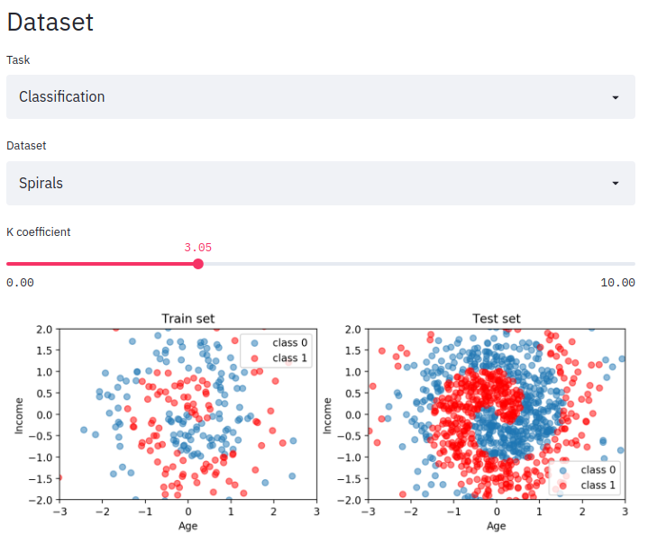
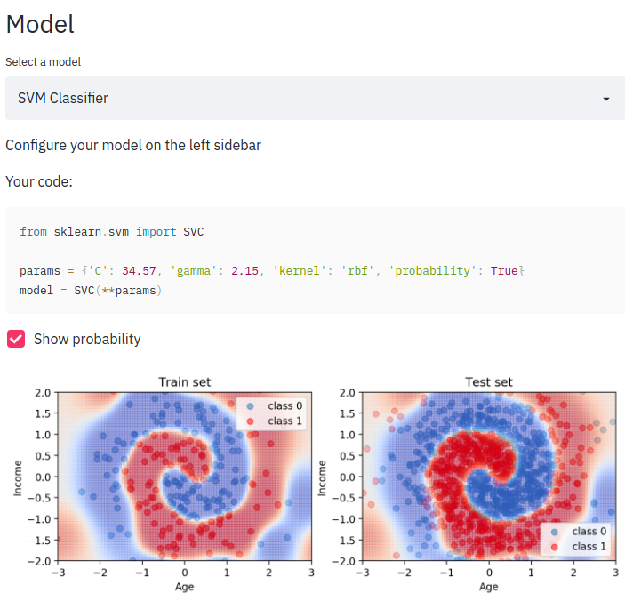

# ML-Toy
A small application in which you can play with very simple machine learning tasks.  
I hope it will help you understand better how machine learning models work.  

It allows you to create a simple 2D dataset and choose one of many sklearn models:
  
You can play with model parameters and see what happens:
  

## Try it online
App is deployed here: https://share.streamlit.io/hocop/ml-toy/ml_toy.py

## Run locally
```
sudo pip3 install streamlit
streamlit run ml_toy.py
```
It will start running on localhost. The browser window should open automaticaly.  
`Procfile` and `setup.sh` are only for heroku, normally you don't need them.

## How it is made
Backend and frontend are written in python using [streamlit](https://www.streamlit.io/) - a python library for simple data science demos like this. This is my first project with streamlit. I made it to learn myself how to use this library.
