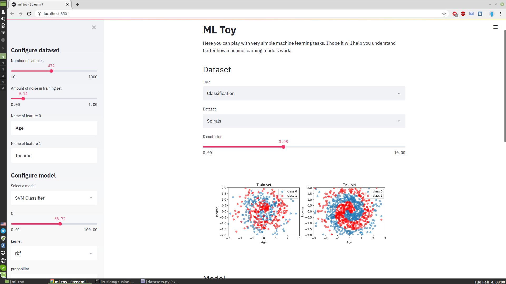
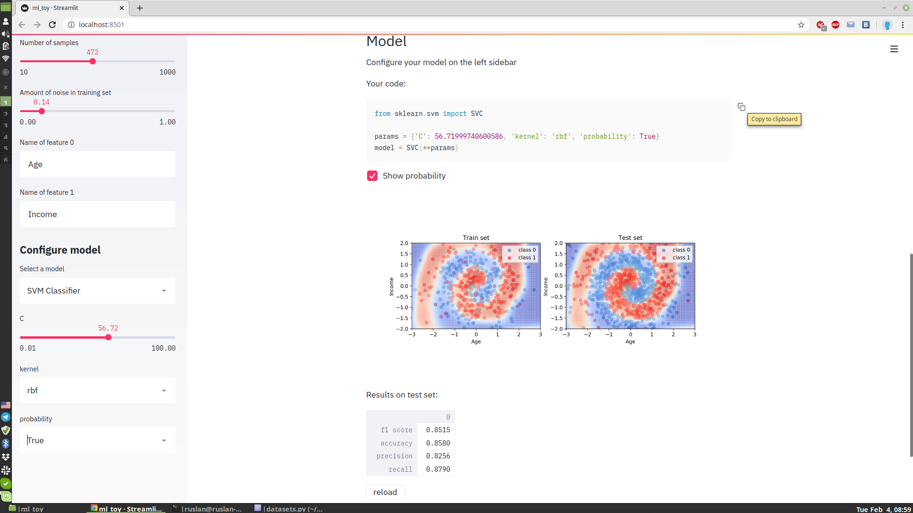

# ML-Toy
A small application in which you can play with very simple machine learning tasks.  
I hope it will help you understand better how machine learning models work.  

It allows you to create a simple 2D dataset and choose one of many sklearn models:

You can play with model parameters and see what happens:


## Try it online
App is deployed here: https://ml-toy.herokuapp.com/

## Run locally
```
sudo pip install streamlit
git clone https://github.com/hocop/ML-Toy
streamlit run ml_toy.py
```
It will start running on localhost. The browser window should open automaticaly.  
`Procfile` and `setup.sh` are only for heroku, normally you don't need them.
